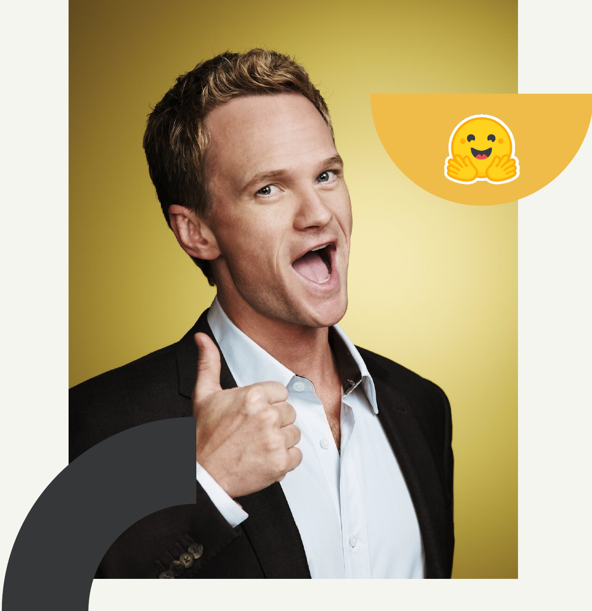

# __ChatBot-Personality-Recognition__

Inspiration from _“A neural chatbot with personality” by Nguyen et al_personality. Published at the Semantic Scholar (2017).



In our [previous project](https://github.com/VTonelli/BarneyBot) we created a chatbot which imitates characters from popular tv shows. Our approach improved on their work thanks to newer architectures based on transformers. Plus, we proposed a more rigorous quantitative analysis of performances using a suite of metrics.

## __Data__

We took from __scripts of famous films and tv shows__, of different level of quality, pre-processing them to extract pairs of well-formatted (line, character) rows. Here the main statisticks of our dataset:

| Character Name  | # Lines | Gained Lines  | Show/Movie   | # Show Lines |
| --------------- | ------- | ------------- | ------------ | ------------ |
| Barney          | 5194    | 3.8%          | HIMYM        | 31776        |
| Bender          | 2388    | 1.1%          | Futurama     | 15226        |
| Fry             | 2716    | 1.4%          | Futurama     | 15226        |
| Harry           | 1037    | 27.8%         | Harry Potter |  4925        |
| Joey            | 8229    | 10.5%         | Friends      | 61023        |
| Phobe           | 7460    | 10.2%         | Friends      | 61023        |
| Sheldon         | 11642   | 2.5%          | TBBT         | 51268        |
| Vader           | 160     | 15.7%         | Star Wars    |  2750        |

## __Chatbot Model__

Architecture: autoregressive model called [DialoGPT](https://arxiv.org/pdf/1911.00536.pdf), built on top of __GTP-2__, fine-tuned independently (different weights) on each character, using the __HuggingFace__ 🤗 library and __Tensorflow__. We tested it with different generation parameters: _Greedy_, _Beams Search_ and _Sampling_.

## __The task__

Our previous project conlcuded that at the moment there isn't any metric capable of completely evaluating a chatbot, in a multilateral aspect (i.e. context align, semantic and personality affinity). Finding a correct and a good suite of metrics is still an open problem.

We attempted to introduce some possible metrics (neural and algorithmic) capable of sitinguishing personlaity of different charactes from text. We argued that the problem is quite hard in context where characters come from the same tv show/movie. We challenged this task of _personality recognition_ exploring the concept of semantic from different perspective and with different approaches, but we think that the problem is still open.

## __New contributions__

In this project two new approaches for personality recognition are explored:

* a sentence graph based embedding approach (_PersGRAPH classifier_)
* a supervised topic modeling classifier approach (BERTopic classifier_)

## __Setup__

1. Create a virtual environment running the following code:

```
python -m venv ./venv
```

2. Activate thevirtual environment by executing the script contained in the folder `venv`

3. Run the installation of requirements

```
pip install -r ./requirements.txt
```
